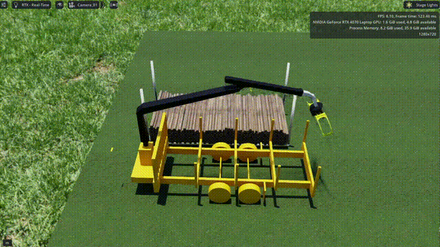
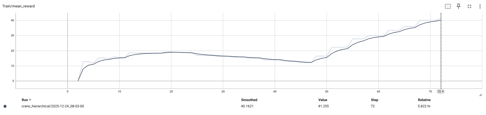

# Hierarchical RL for Crane Log Grasping

A simulation environment for learning forestry crane manipulation using hierarchical reinforcement learning in NVIDIA Isaac Lab.

## Demo

### Heuristic Baseline (Multi-Environment)


*Heuristic baseline policy selecting the highest visible log from the pile. Achieves ~8-12 logs per grasp.*

### High-Fidelity Physics (Single Environment with CCD)



*Single environment running on CPU with Continuous Collision Detection (CCD) enabled, showing clean pile deposition with accurate contact resolution.*

## Training Results



*RL training curves showing learning progress*

## Overview

This project implements an autonomous log grasping system where a reinforcement learning policy selects grasp targets and a finite state machine controller executes pick-place cycles. The environment simulates a forestry crane clearing logs from a pile and stacking them on a trailer.

**Architecture:**
- High-level RL policy: Selects grasp targets (x, y, z, yaw)
- Low-level FSM controller: Executes 10-phase pick-place cycles using inverse kinematics
- Reward function: Multiplicative (logs grasped × alignment) with bonus for high alignment

**Key Features:**
- True hierarchical RL: One policy step executes one complete grasp cycle (~900 physics steps)
- Multi-environment support: Tested with up to 64 parallel simulations
- Dual-stack deposition system with spatial constraints
- Heuristic baseline for comparison

## Environment Specification

**Observation Space** (132 dimensions):
- 32 logs × 4 features: position (x, y, z) and yaw orientation in crane base frame
- Strategic state: logs remaining, cycle count, previous grasp quality

**Action Space** (4 dimensions):
- Target position (x, y, z) in crane base frame
- Target yaw orientation
- Actions normalized to [-1, 1] and mapped to workspace bounds

**Episode Termination:**
- Success: All logs removed from rack
- Timeout: 50 grasp cycles completed

**Reward:**
```python
if logs_grasped == 0:
    reward = -1.0
else:
    base = logs_grasped × alignment
    bonus = logs_grasped × (alignment - 0.7) × 5.0 if alignment > 0.7 else 0
    reward = base + bonus
```

## Installation

### Prerequisites
- Docker with NVIDIA GPU support
- Isaac Lab v2.2.1 or later

### Setup

1. Clone Isaac Lab:
```bash
git clone https://github.com/isaac-sim/IsaacLab.git
cd IsaacLab
```

2. Copy crane_testbed into Isaac Lab root:
```bash
cp -r /path/to/crane_testbed ./
```

3. Configure Docker mount by editing `docker/docker-compose.yaml`:
```yaml
volumes:
  - type: bind
    source: ../crane_testbed
    target: /workspace/crane_testbed
```

4. Start Docker container:
```bash
cd docker
./container.sh start
./container.sh enter
```

5. Set PYTHONPATH inside container:
```bash
export PYTHONPATH=/workspace/crane_testbed/source/crane_testbed:$PYTHONPATH
```

## Usage

### Heuristic Baseline

Run the greedy heuristic policy:
```bash
cd /workspace/isaaclab
./isaaclab.sh -p /workspace/crane_testbed/scripts/envs/crane_rl_env.py --num_envs 1
```

### RL Training

Train using PPO with RSL-RL:
```bash
cd /workspace/isaaclab
export PYTHONPATH=/workspace/crane_testbed/source/crane_testbed:$PYTHONPATH

./isaaclab.sh -p /workspace/crane_testbed/scripts/rsl_rl/train.py \
    --task Isaac-Crane-Direct-v0 \
    --num_envs 4
```

Monitor with TensorBoard:
```bash
tensorboard --logdir /workspace/logs/rsl_rl/crane_hierarchical
```

### Policy Evaluation

Evaluate a trained checkpoint:
```bash
./isaaclab.sh -p /workspace/crane_testbed/scripts/rsl_rl/play.py \
    --task Isaac-Crane-Direct-v0 \
    --num_envs 1 \
    --checkpoint /workspace/logs/rsl_rl/crane_hierarchical/model_1000.pt
```

## Configuration

### PPO Hyperparameters
Located in `source/crane_testbed/crane_testbed/agents/rsl_rl_cfg.py`:
```python
num_steps_per_env = 4          # Cycles collected before policy update
max_iterations = 5000           # Total training iterations
learning_rate = 3e-4
actor_hidden_dims = [256, 128, 64]
critic_hidden_dims = [256, 128, 64]
```

### Environment Configuration
Located in `source/crane_testbed/crane_testbed/tasks.py`:
```python
use_hierarchical_rl = True     # Enable hierarchical mode
episode_length_s = 600.0        # Max episode duration
```

## Implementation Details

### Hierarchical Step Architecture

The environment overrides `step()` to execute a complete grasp cycle per call:

1. Policy selects target (x, y, z, yaw)
2. Internal physics loop runs FSM until logs are lifted (CARRY_HOME phase)
3. Grasp outcome evaluated (number of logs, alignment quality)
4. Physics loop continues until crane returns to HOVER_UP phase
5. Return (observation, reward, done, truncated, info)

This reduces episode length from ~27,000 physics steps to 30-50 policy steps.

### FSM Controller Phases

1. HOVER_UP: Position above pile, wait for policy target
2. ALIGN_YAW: Rotate gripper to target orientation
3. DESCEND: Lower to grasp height
4. CLOSE: Close gripper fingers
5. LIFT_HIGH: Lift logs clear of pile
6. CARRY_HOME: Transport to drop zone
7. ALIGN_HOME_YAW: Orient for stacking
8. LOWER_TO_DROP: Place on stack
9. OPEN: Release gripper
10. SETTLE: Wait for physics stabilization

### Action Space Bounds

Per-environment bounds computed based on rack position:
- X: Rack center ± 1.5m (allows end grasps)
- Y: Rack width (5 rows × 1m) + 1m margin
- Z: Rack base to stack top + 0.35m
- Yaw: [-π, π] with 180° flip optimization

## Project Structure

```
crane_testbed/
├── assets/
│   ├── urdf/fpiforwarder-upperpassive.urdf
│   └── scenes/
├── scripts/
│   ├── envs/
│   │   └── crane_rl_env.py           # Main environment (3500+ lines)
│   └── rsl_rl/
│       ├── train.py                  # Training script
│       ├── play.py                   # Evaluation script
│       └── cli_args.py
├── source/
│   └── crane_testbed/
│       ├── setup.py
│       └── crane_testbed/
│           ├── tasks.py              # Gym environment registration
│           └── agents/
│               └── rsl_rl_cfg.py     # PPO configuration
├── README.md
└── requirements.txt
```

## Technical Requirements

- Python 3.10+
- Isaac Lab 2.2.1+
- All dependencies provided by Isaac Lab (PyTorch, DifferentialIK, etc.)

## License

Apache-2.0
