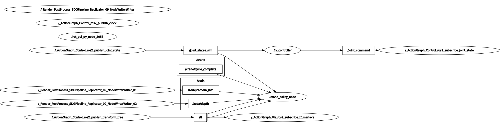

# crane_lab_ros2

ROS2 nodes and Isaac Sim scene for running a learned point-cloud
grasping policy on the crane lab. All dependencies (patched USD,
referenced assets, trained checkpoint, `sim_interface` service
definitions) are bundled.

## Layout

```
crane_lab_ros2/
├── nodes/                  # the runtime
│   ├── crane_policy_node.py        # depth -> policy -> FSM -> EE targets
│   ├── jv_controller_node.py       # EE target -> joint commands (ikpy + PD)
│   ├── fsm.py                      # 10-phase pick-and-place state machine
│   ├── pointcloud_pipeline.py      # depth + intrinsics -> 1024-pt PCD
│   ├── policy_loader.py            # loads bcrl/rl/heuristic checkpoints
│   └── pointnet_actor_critic.py    # PointNet model used by bcrl/rl
├── sim_interface/          # ROS2 service definitions
│   └── srv/
│       ├── SetTarget.srv
│       └── CheckTargetReached.srv
├── scenes/
│   └── log_loader_crane_lab_grasping.usd   # open this in Isaac Sim
├── assets/                 # USD assets the scene references
│   ├── crane/, rack/, logs/, ZED_X/, materials/, domelights/
├── checkpoints/
│   └── model_350.pt        # trained BC+RL policy
├── requirements.txt
└── README.md
```

## Prerequisites

- Isaac Sim 5
- ROS2 Humble
- Python 3.10 with `torch`, `numpy`, `ikpy` (`pip install -r requirements.txt`)
- A workspace with `sim_interface/` built and sourced

## Setup

### 1. Build `sim_interface`

The two ROS2 services (`SetTarget`, `CheckTargetReached`) need to be
compiled into your workspace:

```bash
mkdir -p ~/crane_ws/src
ln -sfn /path/to/crane_lab_ros2/sim_interface ~/crane_ws/src/sim_interface
cd ~/crane_ws
source /opt/ros/humble/setup.bash
colcon build --packages-select sim_interface --symlink-install
source install/setup.bash
```

Add the last `source` to your shell rc so future terminals pick it up.

### 2. Install Python dependencies

```bash
pip install -r /path/to/crane_lab_ros2/requirements.txt
```

## Running

### Terminal 1: Isaac Sim with the scene

Launch Isaac Sim, then `File -> Open` ->
`crane_lab_ros2/scenes/log_loader_crane_lab_grasping.usd`.
Press **Play** in the timeline.

The scene's action graphs publish:

- `/zedx/depth` (sensor_msgs/Image, 32FC1, meters)
- `/zedx/camera_info` (sensor_msgs/CameraInfo)
- `/zedx/rgb` (sensor_msgs/Image)
- `/joint_states_sim` (sensor_msgs/JointState)
- `/tf`, `/clock`

...and subscribes to `/joint_command` (sensor_msgs/JointState) for joint
position and velocity targets.

### Terminal 2: Joint-velocity controller

```bash
source ~/crane_ws/install/setup.bash
python3 /path/to/crane_lab_ros2/nodes/jv_controller_node.py
```

### Terminal 3: Policy node

```bash
source ~/crane_ws/install/setup.bash
python3 /path/to/crane_lab_ros2/nodes/crane_policy_node.py \
    --policy_type bcrl \
    --checkpoint /path/to/crane_lab_ros2/checkpoints/model_350.pt
```

## Pipeline

The policy node drives a 10-phase FSM
(`HOVER_UP -> ALIGN_YAW -> DESCEND -> CLOSE -> LIFT_HIGH -> CARRY_HOME ->
ALIGN_HOME_YAW -> LOWER_TO_DROP -> OPEN -> SETTLE -> CLEAR`), then
re-runs the policy on the next depth frame to start a new cycle.



## Swapping the policy checkpoint

Pass `--checkpoint /path/to/your/model.pt` to the policy node.

The checkpoint format must match what `policy_loader.RslRlPolicy`
expects: an RSL-RL `.pt` file with a `model_state_dict`. The PointNet
variant (`--policy_type bcrl` or `--policy_type rl`) detects PointNet
vs. MLP from the state-dict keys automatically.

Action bounds are passed via ROS params:

```bash
--ros-args -p bounds_min:='[-5.0, -0.75, -1.373]' \
           -p bounds_max:='[-3.0, 4.59, -0.373]'
```

These must match what the policy was trained against. The defaults
correspond to the trained `model_350.pt` shipped here.
